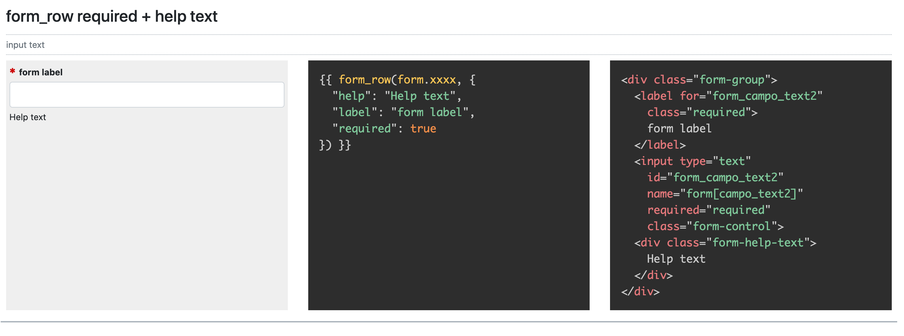

# Symfony Bootstrap 4 Form Theme

A [Bootstrap](https://getbootstrap.com/) 4 Form Theme for [Symfony](https://symfony.com/) 3, 4 and 5.

v.2 - Oct 2020

For a complete lookup to all widgets and parameter take a look at <https://massimo-cassandro.github.io/symfony-bootstrap-form-theme/>: it is a static page generated by the html produced by the test app and can be viewed without installing Symfony or anything else.


## Quick install

If you don't need the whole test application, you can only download the files located in the `dist` folder, that contains the js and scss files and `bs4_form_layout.html.twig`.

You can also install them in your project using npm:

```
npm i --save --only=prod @massimo-cassandro/symfony-bootstrap-form-theme
```

## Using the form theme

* Add the `/dist/scss/_forms.scss` file to your scss (after Bootstrap css). Change default options if necessary.

>In the demo page, `_forms.scss` is bundled within the `public/assets/sf-bs4-form-test.scss` file.

* If you want to use the multiselect widget, add the `_forms-multiselect.js` and `_forms-multiselect.scss` files (both located in the `dist` folder) to your js and scss.

> In the demo page, both files are bundled within the main js and scss files.

* Copy the `dist/bs4_form_layout.html.twig` file in your *template* folder
* Modify your configuration file as explained below:

**Symfony 5 `/config/packages/twig.yaml`**

```yaml
twig:
    form_themes:
      - 'path/to/bs4_form_layout.html.twig'
```


**Symfony 3 `config.yml`**

```yaml
# Twig Configuration
twig:
    paths:
      - "path/to/bs4_form_layout.html.twig"
```


## Using the Symfony test application

You can clone the test app repository and run the form test app:
* clone the repo and run composer to install Symfony.
* run npm in the `public/assets` directory allowing dev dependencies (omit the `--only=prod` flag):

```
npm i --save @massimo-cassandro/symfony-bootstrap-form-theme
```

* The main twig file is: `templates/index.html.twig`
* The controller is: `src/Controller/DefaultController.php`
* The form theme used for testing is: `templates/bs4_form_layout_WORK_COPY.html.twig`
* js and scss source files are located in `/src` folder

The test page gives you detailed informations about all form widgets:



You can easily modify the template, the js or the css and immediately test the result.

Run `sh build.sh` to update the `dist` and `docs` folders, if you need.
`build.sh` creates a static html file from the Symfony page. You may need the change the url of your local domain in `gulpfile.js`.

### Codekit

I've used [Codekit](https://codekitapp.com/) to build js and scss in the test app (the `assets/config.codekit3` file contains the project configuration), anyway to can easily switch to another tool.

## Symfony Widgets Reference

### General

* The `help` parameter allows you to add custom help text. It adds a `div.form-help-text` element to the rendered markup that contains the help string (HTML can be used). The `form-help-text` class is defined in `_forms.scss`.

```twig
{{ form_row(form.xxxx, {
  "help": "Help text"
}) }}
```

```markup
<div class="form-group">
  <!-- ... -->
  <div class="form-help-text">
    Help text
  </div>
</div>
```

* The `disabled: true` parameter adds a `disabled` class to the group container element (in addition to the `disabled` attribute of the field); this allows you to stylize the whole field group.

```twig
{{ form_row(form.xxxx, {
  disabled: true
}) }}
```

```markup
<div class="form-group disabled">
  <!-- ... -->
</div>
```


* A new `params` parameter allows you to change some behaviour of the widgets. It is a json-like element whose sub-parameters changed depending on the widget used. You can find the whole list of parameters below. Take also a look at the [sample page](https://massimo-cassandro.github.io/symfony-bootstrap-form-theme/).

```twig
{{ form_row(form.xxxx, {
  params: {
    bs_custom_control: true
  }
}) }}
```

#### Parameters

* **`container`**: generates a `.form-group` div or fieldset (if the element is a collection) wrapping the form element
* **`container_class`**: add a custom class to the container element
* **`collection_container`**: specify if a container element must be added for collecions
* **`before`** and **`after`**: markup for input groups elements (see examples)
* **`raw_label`**: if true, allows using html for labels (default false)
* **`top_label`**: single checkboxes only, put the label at the top of the element
* **`bs_custom_control`**: if true, activates Bootstrap custom controls (default false, see examples)
* **`inline`**: checkboxes and radio buttons only, if true disposes elements inline (default false)
* **`no_items_mes`**: collections only, message to be displayed if the Choice array is empty (see examples)
* **`multiselect`**: collection only, generates a multiselect element
* **`button_class`**: multiselect only, class for button element (default: btn-multiselect, defined in _forms.scss)
* **`menu_class`**: multiselect only, class for menu element
* **`columns`**: collections only, activates a multicolumns layout (see examples)


### Checkboxes

#### Single checkboxes

* The default behaviour generate the Bootstrap default stacked markup wrapped into a `.form-group` container:

```markup
<div class="form-group">
  <div class="form-check">
    <input type="checkbox"
      id="custom-id"
      name="form[checkboxField2]"
      class="form-check-input"
      value="1">
    <label for="custom-id">
      Checkbox label
    </label>
  </div>
</div>
```

* You can avoid the `.form-group` container using the `params.container` parameter. Note however that any `help` parameter will be ignored, as it is related to the presence of the container:

```twig
{{ form_row(form.xxxx, {
  "params": {
    "container": false
  }
}) }}
```

* A single checkbox with label on top, can be obuained thru the `top_label` option. This option requires the `.form-group`, therefore the `params.container` is always forced to true.

```twig
{{ form_row(form.xxxx, {
  "params": {
    "top_label": true
  }
}) }}
```

* Custom checkbox control can be activated using the `params.bs_custom_control` parameter:

```twig
{{ form_row(form.xxxx, {
  "params": {
    "bs_custom_control": true
  }
}) }}
```

* Custom checkbox controls use `::before` and `::after` pseudo-elements, which makes it impossible to use the `::before` pseudo-element used for styling required fields' labels. For this reason, the required parameter, if associated with a custom-checkbox, generates a `<span class="required">` element placed after the `label` element. Therefore, in this case, the asterisk for required fields is located after the label string and not before:

```markup
<div class="custom-control custom-checkbox">
  <input type="checkbox" ... >
  <label...>...</label>
  <span class="required"></span>
</div>
```
* Actually, custom checkbox is incompatible with the `params.container` and `params.top_label` options, therefore they will be ignored even if they are setted to true. For the same reason, the `help` parameter will not take effect with custom checkbox, as it is related to the `.form-group` container.

#### Multiple checkboxes

Multiple checkboxes are element rendered by the `ChoyceType` type (https://symfony.com/doc/current/reference/forms/types/choice.html) with 'expanded' => true, 'multiple' => true options.

The **multiple columns** option requires a scss file included in my [m-utilities](https://github.com/massimo-cassandro/m-utilities) package.

After downloaded the package, you need to add the respoinsive columns file to your scss:

```scss
@import 'path/to/node_modules/m-utilities/sass_utilities/bs4_responsive_columns';
```

See the [`_forms.scss`](/symfony-bootstrap-form-theme/blob/master/web/public/forms/_forms.scss) file and [test result page](https://massimo-cassandro.github.io/symfony-bootstrap-form-theme/#multiple_cboxes_multi_columns) for info and examples.

Take a look to the [test result page](https://massimo-cassandro.github.io/symfony-bootstrap-form-theme/#multiple_checkboxes) for detailed info.

### Radios

Radio buttons options are the same of checkboxes.

### Multiselect
Multiple checkboxes and radio button can be displydes as a dropdown using the `multiselect` option.

This option is inspired by the <a href="http://davidstutz.de/bootstrap-multiselect/">Bootstrap Multiselect plugin</a>, and offers a way to arrange in a more compact way multiple elements.

For usability reasons, it should not be used with a large number of items.

To activate this option set `params.multiselect` to `true` for default settings, or set placeholder and specific classes for menu and buttons as described in [Bootstrap docs](https://getbootstrap.com/docs/4.4/components/dropdowns/):

```twig
{{ form_row(form.xxxx, {
  "params": {
    "multiselect": true
  }
}) }}

{{ form_row(form.xxxx, {
  "params": {
    "multiselect": {
        placeholder: 'Select an option'
        button_class: '...',
        menu_class: '...'
    }
  }
}) }}
```
This option needs some [Bootstrap JS components](https://getbootstrap.com/docs/4.4/components/dropdowns/#overview), [Popper.JS](https://popper.js.org/) and [jQuery](https://jquery.com/).

In addition, the `_forms.js` script is needed.

### Select elements

* Select elements have `custom-select` class (<https://getbootstrap.com/docs/4.4/components/forms/#select-menu>) by default, this behaviour can be changed using the `params` element of `form_row`

### Input groups

This option allows to add text, buttons, or button groups on either side of textual inputs, selects, or file inputs.

Add a `before` and/or an `after` parameter to the `params` option to generate an input group.

Look at the [test page](https://massimo-cassandro.github.io/symfony-bootstrap-form-theme/#input_groups) for detailed info and examples

```twig
{{ form_row(form.xxxx, {
  "params": {
    "before": [
      {
        "type": "text",
        "content": "$"
      }
    ],
    "after": [
      {
        "type": "text",
        "content": ".00"
      }
    ]
  }
}) }}
```

## TODO
* readonly checkboxes
* check bootstrap validation markup
* errors
* custom validity
* Grouped stacked checkboxes
* progress?
* buttons?
* date interval?
* css for sizing classes
* range: current value label, step labels
* Option for adding custom classes to fieldset or div containers
* Option to have help text printed at bottom of radio buttons or multiple checkboxes


## Reference
* <https://symfony.com/doc/current/form/form_customization.html>
* <https://symfony.com/doc/3.4/form/form_themes.html>
* <https://symfony.com/doc/3.4/forms.html>
* <https://symfony.com/doc/current/reference/forms/types.html>
* <https://symfony.com/doc/3.4/form/rendering.html>
* <https://symfony.com/doc/3.4/reference/forms/twig_reference.html>
* <https://symfony.com/doc/3.4/form/bootstrap4.html>
* <https://getbootstrap.com/docs/4.4/components/forms/>
* <https://getbootstrap.com/docs/4.4/components/input-group/>
* <https://getbootstrap.com/docs/4.4/components/buttons/>


## Changelog

### v.2.1 / Nov 2020
* Implemented `aria-describedby` attribute for help text ([issue #2](https://github.com/massimo-cassandro/symfony-bootstrap-form-theme/issues/2))
* Inline radios and checkboxes fix
* Option for using html strings for labels

### v.2 / Oct 2020
* Environment switched to Symfony 5
* All js scripts rearranged as ES modules


### v.1 / Sep 2019
* First release built on Symfony 3
